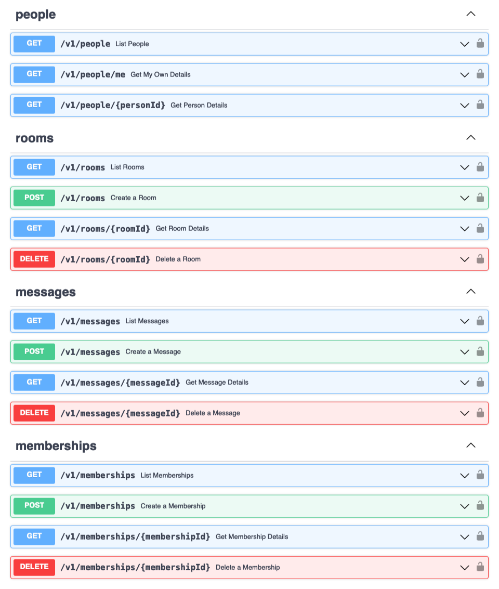

# swagger-webex

Swagger Specification for Webex Developer API Endpoints

This swagger specification file has been written for use in [Power Automate](https://make.powerautomate.com) for developing flows using an authentication key instead of OAuth (i.e. Bot Accounts)

The exposed API paths can be reviewed using the [Swagger Editor](https://editor.swagger.io/?url=https://raw.githubusercontent.com/jeremywillans/swagger-webex/master/swagger.yaml)

**Note:** The API key for this connector must be prefixed with "Bearer " otherwise it will not be valid and return a 401 Error.

## Deployment (Power Automate)

1. Open and authenticate into [Power Automate](https://make.powerautomate.com)
2. Navigate to Data > Custom Connectors
3. (Optional) Download the Webex logo.png file for use during creation
4. From the `New custom connector` dropdown, select `Import an OpenAPI from URL`
5. Provide a name and the URL to the swagger.json file, then select `Continue`
   
   `https://raw.githubusercontent.com/jeremywillans/swagger-webex/master/swagger.json`
6. (Optional) Upload the connector icon
7. Select `Create connector`

Note: You can also optionally download the swagger.json file and import using the `Import an OpenAPI file` option.

## Support

In case you've found a bug, please [open an issue on GitHub](../../issues).

## Disclaimer

This software is NOT guaranteed to be bug free and production quality.
